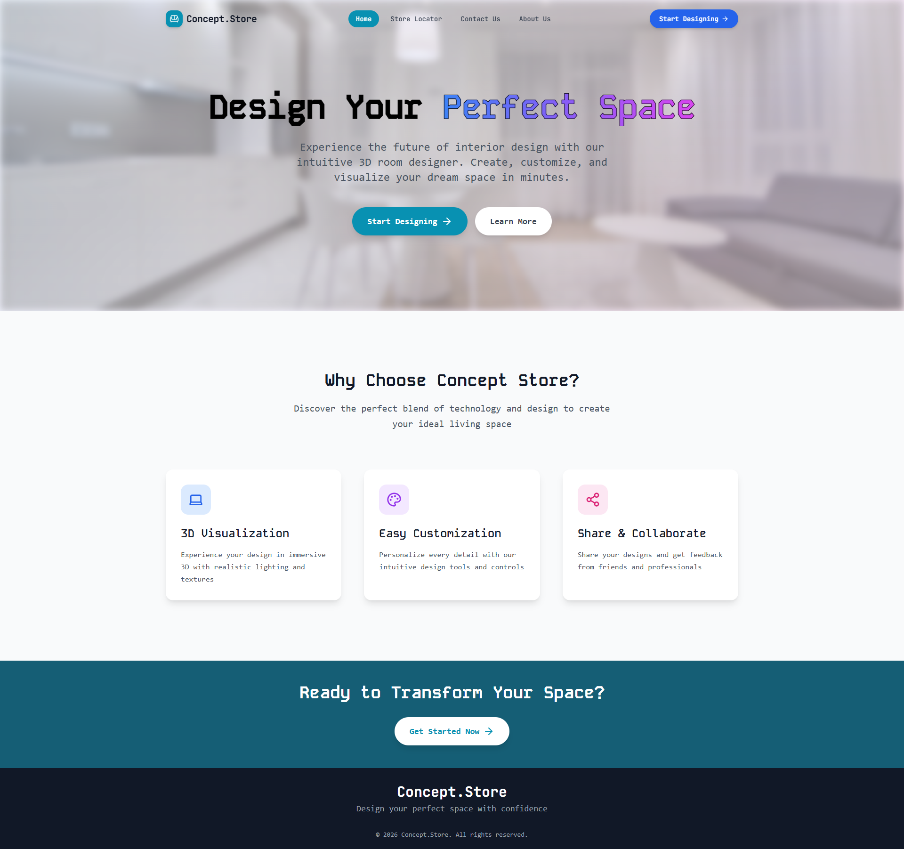
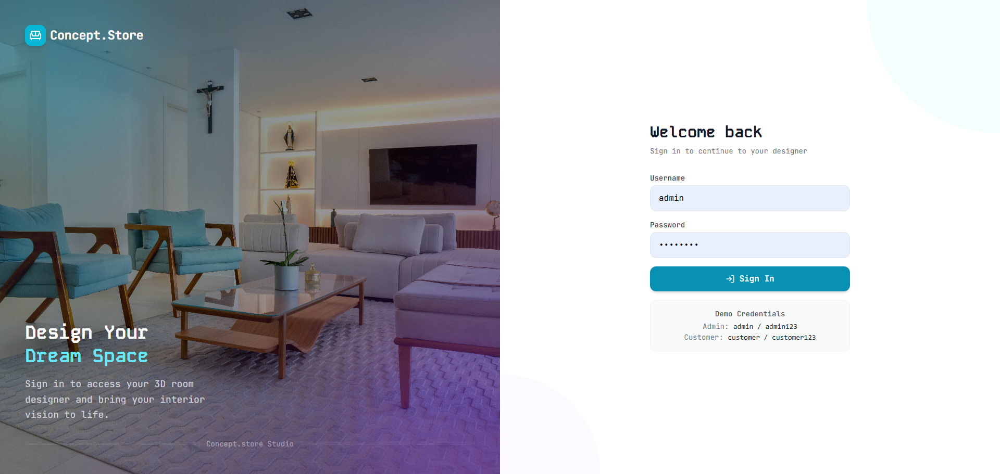
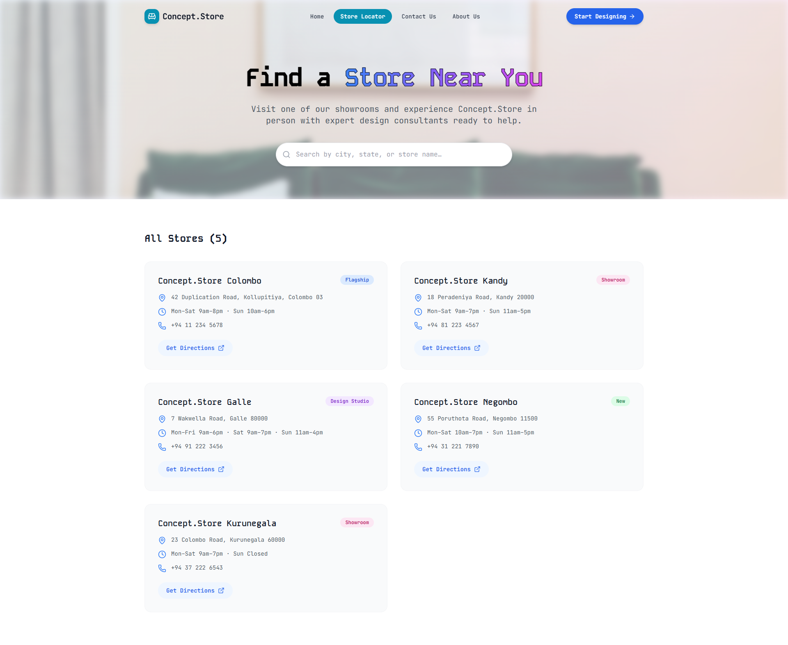
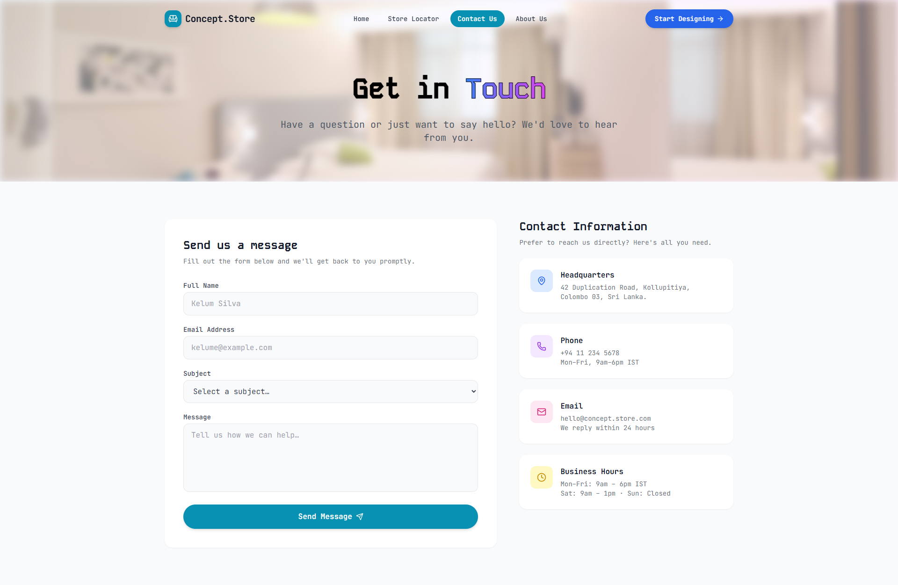
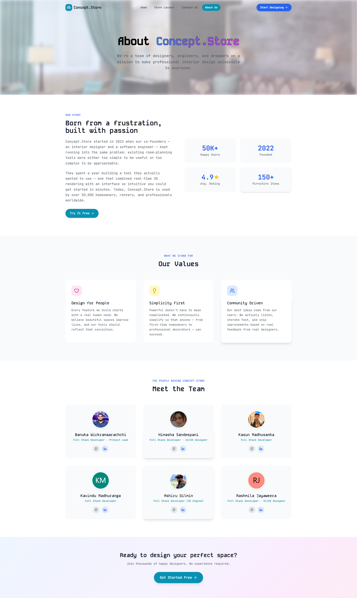
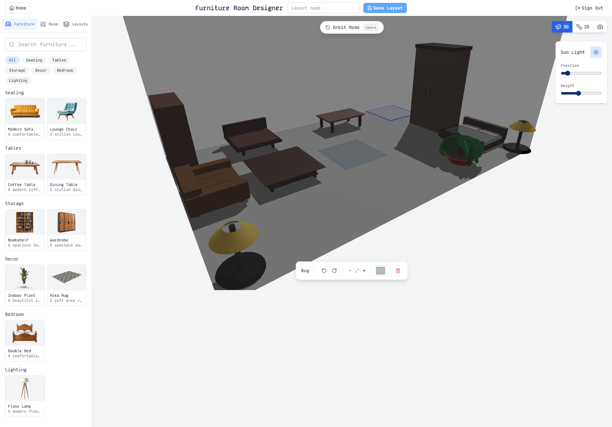
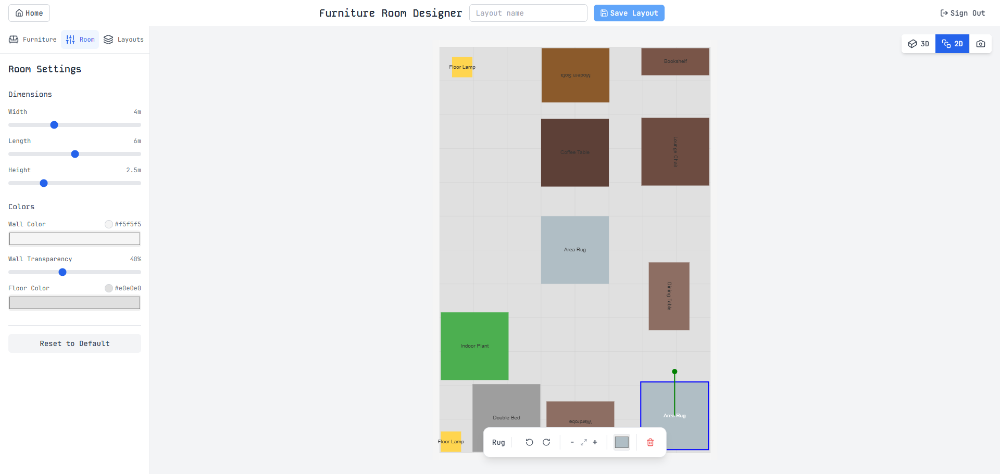

<!-- Replace the src below with your actual logo path once available -->
<!-- <p align="center">
  
</p> -->

<h1 align="center">🛋️ Concept.Store — 3D Room Designer</h1>

<p align="center">
  <strong>An interactive 3D/2D furniture room planner built with React, Three.js, and TypeScript.</strong>
</p>

<p align="center">
  <a href="#-features">Features</a> •
  <a href="#️-tech-stack">Tech Stack</a> •
  <a href="#-getting-started">Getting Started</a> •
  <a href="#-project-structure">Project Structure</a> •
  <a href="#-authentication">Authentication</a> •
  <a href="#-contributing">Contributing</a>
</p>

<p align="center">
  
  
  
  
  
</p>

<p align="center">
  <a href="https://3-d-furniture-simulator.vercel.app/"></a>
  
  
  
</p>

---

## 📸 Screenshots

<p align="center">
  
</p>

<details>
<summary><strong>🖼️ View More Screenshots</strong></summary>

<br />

| Page                     | Screenshot                                                 |
| ------------------------ | ---------------------------------------------------------- |
| **Home**        |               |
| **Login**        |               |
| **Store Locator**        |  |
| **Contact Us**       |        |
| **About Us**              |             |
| **3D Designer** |   |
| **3D Designer**         |             |


</details>

---

## 🌐 Overview

**Concept.Store** is a browser-based interactive room designer. Users can place, move, rotate, and colour 10 different 3D furniture models in both an immersive 3D view and a precise 2D floor-plan view. Designs can be saved, loaded, and exported as screenshots.

---

## ✨ Features

| Feature                     | Description                                                                         |
| --------------------------- | ----------------------------------------------------------------------------------- |
| 🧊 **3D Room Editor**       | Interactive 3D canvas with orbit controls, shadows, and dynamic lighting            |
| 🗺️ **2D Floor-Plan Editor** | Top-down view with drag, drop, and rotate support                                   |
| 🛋️ **10 Furniture Models**  | Sofa, chair, bed, wardrobe, bookshelf, dining table, coffee table, plant, rug, lamp |
| 🎨 **Colour Picker**        | Real-time per-furniture colour customisation                                        |
| 🏠 **Room Customisation**   | Adjust wall colour, floor colour, wall opacity, and room dimensions                 |
| 💾 **Save & Load Layouts**  | Persist room designs to local storage                                               |
| 📸 **Screenshot Export**    | Capture and download your design from both 2D and 3D views                          |
| 🔐 **Authentication**       | Protected designer route with login system                                          |
| 📱 **Responsive UI**        | Fully responsive layout with Tailwind CSS                                           |

---

## 🛠️ Tech Stack

<table>
<tr>
<th align="center">Frontend</th>
<th align="center">3D Graphics</th>
<th align="center">Tooling</th>
</tr>
<tr>
<td align="center">
<br />React 19
</td>
<td align="center">
<br />Three.js 0.182
</td>
<td align="center">
<br />Vite 6.x
</td>
</tr>
<tr>
<td align="center">
<br />TypeScript 5.x
</td>
<td align="center">
<br />React Three Fiber 9.x
</td>
<td align="center">
<br />Tailwind CSS 4.x
</td>
</tr>
<tr>
<td align="center">
<br />React Router 7.x
</td>
<td align="center">
<br />React Three Drei 10.x
</td>
<td align="center">
<br />Zustand 5.x
</td>
</tr>
</table>

### Utilities

| Package          | Purpose                   |
| ---------------- | ------------------------- |
| `react-colorful` | Lightweight colour picker |
| `file-saver`     | Screenshot download       |
| `lucide-react`   | Icon set                  |
| `uuid`           | Unique ID generation      |

---

## 🚀 Getting Started

### Prerequisites

- **Node.js** >= 18.x
- **npm** >= 9.x

### Installation

```bash
# 1. Clone the repository
git clone https://github.com/WickramaarachchiBS/3D-furniture-simulator.git
cd 3D-furniture-simulator

# 2. Install dependencies
npm install

# 3. Start the development server
npm run dev
```

Open [http://localhost:5173](http://localhost:5173) in your browser.

---

## 📜 Scripts

```bash
npm run dev        # Start Vite development server
npm run build      # Type-check + production build
npm run preview    # Preview production build locally
npm run lint       # Run ESLint
```

---

## 📡 API Endpoints

### Base URL

```
Development Local: http://localhost:5173/
Deployed Production URL: https://3-d-furniture-simulator.vercel.app/
```

### Quick Reference

| Route            | Access       | Description   |
| ---------------- | ------------ | ------------- |
| `/`              | Public       | Landing page  |
| `/login`         | Public       | Login form    |
| `/designer`      | 🔒 Protected | Room designer |
| `/about`         | Public       | About page    |
| `/contact`       | Public       | Contact page  |
| `/store-locator` | Public       | Store locator |

---

## 📁 Project Structure

```
3D-furniture-simulator/
├── public/
│   └── thumbnails/              # Furniture thumbnail images
├── src/
│   ├── assets/                  # Static assets
│   ├── components/
│   │   ├── room/
│   │   │   ├── Furniture3D.tsx        # 3D furniture models (React Three Fiber)
│   │   │   ├── Room3D.tsx             # 3D room shell (walls, floor)
│   │   │   ├── RoomEditor2D.tsx       # 2D canvas floor-plan editor
│   │   │   ├── RoomEditor3D.tsx       # 3D editor with drag & collision
│   │   │   └── FurnitureControls.tsx
│   │   ├── sidebar/
│   │   │   ├── FurnitureList.tsx      # Furniture picker panel
│   │   │   ├── RoomControls.tsx       # Room dimension & colour controls
│   │   │   └── SavedLayouts.tsx       # Save/load panel
│   │   ├── Header.tsx
│   │   ├── Navbar.tsx
│   │   ├── RoomEditor.tsx             # Editor shell (2D/3D toggle)
│   │   ├── Sidebar.tsx
│   │   └── ViewToggle.tsx             # 2D/3D switch + screenshot
│   ├── data/
│   │   └── defaultFurniture.ts        # Furniture template definitions
│   ├── pages/
│   │   ├── Designer.tsx               # Protected designer page
│   │   ├── Landing.tsx
│   │   ├── Login.tsx
│   │   ├── AboutUs.tsx
│   │   ├── ContactUs.tsx
│   │   └── StoreLocator.tsx
│   ├── store/
│   │   ├── AuthProvider.tsx           # Authentication context
│   │   └── StateProvider.tsx          # Global app state (Zustand)
│   ├── types.ts                       # Shared TypeScript types
│   ├── App.tsx                        # Root component & routing
│   └── main.tsx                       # Entry point
├── index.html
├── package.json
├── tsconfig.json
├── tailwind.config.js
└── vite.config.ts
```

---

## 🌍 Deployment

This project is live on **Vercel** — [https://3-d-furniture-simulator.vercel.app/](https://3-d-furniture-simulator.vercel.app/)

### Manual Production Build

```bash
npm run build
# Output is in the dist/ folder — upload to any static hosting provider
```

---

## 🤝 Contributors

<table>
<tr height="200">
<td align="center" width="120">
<a href="https://github.com/WickramaarachchiBS">

<br />
<sub><b>Wickramaarachchi B S</b></sub>
</a>
<br />
<sub>Project Lead<br>Full Stack Developer</sub>
</td>

<td align="center" width="120">
<a href="https://github.com/Himashasandeepani">

<br />
<sub><b>Himasha Sandeepani</b></sub>
</a>
<br />
<sub>UI / UX Designer<br>Full Stack Developer</sub>
</td>

<td align="center" width="120">
<a href="https://github.com/Kasuuun7">

<br />
<sub><b>Kasun Madhusanka</b></sub>
</a>
<br />
<sub>Full Stack Developer</sub>
</td>
<td align="center" width="120">
<a href="https://github.com/Kavix31299">

<br />
<sub><b>Kavindu Madhuranga</b></sub>
</a>
<br />
<sub>Full Stack Developer</sub>
</td>
<td align="center" width="120">
<a href="https://github.com/ashiru202">

<br />
<sub><b>Ashiru</b></sub>
</a>
<br />
<sub>Full Stack Developer (3D Engine)</sub>
</td>
<td align="center" width="120">
<a href="https://github.com/JayaweeraHRK">

<br />
<sub><b>Rashmila Jayaweera</b></sub>
</a>
<br />
<sub>UI / UX Designer<br>Full Stack Developer</sub>
</td>
</tr>
</table>

---

## 📄 License

This project is licensed under the **MIT License** — see the [LICENSE](LICENSE) file for details.

---

## 🙏 Acknowledgments

- [React Three Fiber](https://docs.pmnd.rs/react-three-fiber) — bringing Three.js into the React ecosystem
- [React Three Drei](https://github.com/pmndrs/drei) - helpers and abstractions for R3F
- [Three.js](https://threejs.org/) - 3D graphics engine
- [Zustand](https://github.com/pmndrs/zustand) - state management
- [Tailwind CSS](https://tailwindcss.com/) - Styling framework
- [Vite](https://vitejs.dev/) - development server and build tool
- [react-colorful](https://github.com/omgovich/react-colorful) - colour picker component

---

<p align="center">
  <strong>⭐ Star this repository if you found it helpful!</strong>
</p>

<p align="center">
  <a href="https://github.com/WickramaarachchiBS/3D-furniture-simulator/issues">Report Bug</a>
  •
  <a href="https://github.com/WickramaarachchiBS/3D-furniture-simulator/issues">Request Feature</a>
  •
  <a href="https://3-d-furniture-simulator.vercel.app/">Live Demo</a>
</p>

<p align="center">
  Built with ❤️ using React, Three.js &amp; TypeScript
</p>
